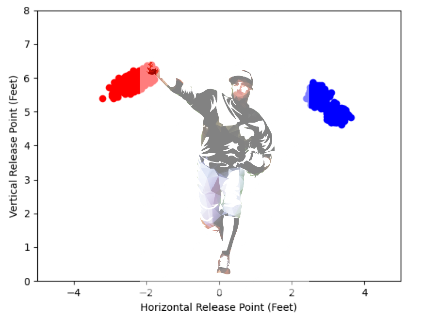
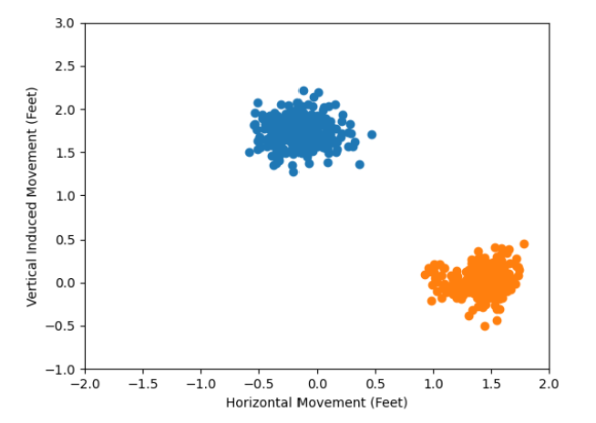

# What Makes the Perfect Fastball?
# By Simon Todreas, Ben Steel, and AJ Finn

## Installation Instructions
All original pitch data downloaded from https://baseballsavant.mlb.com/statcast_search 

## Getting Started Guide
To start cleaning the data we want to remove all irrelevant columns, keeping only 'pitcher', 'batter', 'release_speed', 'release_pos_x', 'release_pos_z', 'pfx_x', 'pfx_z', 'release_spin_rate', 'release_extension', 'spin_axis', and 'description'. The description column will be changed to swinging_strike and values will be set to 1 if swinging_strike was the description, and 0 otherwise. Next, a new column is added containing the total number of pitches thrown during the 2022 season by whichever pitcher the pitch corresponds to. This is done to eliminate players from the table with less than 100 pitches, after removing them the numPitches column is removed. Now, we are ready to web scrape to build our table of pitcher demographic data where each pitcher is an entry as opposed to every pitch as in the other table. From the pitch table we are able to get a unique pitcher ID that will act as a primary key in the pitcher table. Web scraping from mlb.com with the ID will generate various demographic information for the pitcher including, throwing hand, height, weight, age as of July 1 2022. In addition to including this data in the table, aggregated pitch data for each pitcher will also be included. Aggregation was done for 'release_speed', 'release_pos_x', 'release_pos_z', 'pfx_x', 'pfx_z', 'release_spin_rate', 'release_extension', 'spin_axis', 'swinging_strike' by calculating the mean.
## Examples

Section unclean data from baseball savant

Horizontal vs Vertical release point for two pitchers

Horizontal vs Vertical movement for two pitchers

## BDD-Style Feature Documentation
Data Normalization

As a user exploring and analyzing the data, I want two linked tables to separately examine pitcher specific information and individual pitch characteristics.
As a user analyzing the pitch data, I may be curious about the effect that age, for example, has on pitch movement to see if it is predictive of pitch success. However it would be expensive and repetitive to have age listed for every pitch, so we will include pitcher specific information in a separate table from the pitch information. These tables will be linked by a pitcher ID so users can join them and use all information should they please.

Data Aggregation

As a user analyzing the pitch data, I want statistical information aggregated by taking averages on a pitcher by pitcher basis. This will allow the user to compare the pitchers directly for each statistic of interest, providing further insight into what statistics have the most effect on whether the ball is hit or not. Aggregating the data will make it easier to identify statistics that have the most influence on whether the ball is hit or not.

Web Scraping

As a user analyzing the data I want to have access to as many possibly helpful variables as possible. I also don’t want to have to spend too much time combining various datasets or searching for my variables through other sources. I may not only want to look at a pitcher’s detailed spin rates, velocities, or similar stats but instead I want to see more general data such as height or weight that isn’t included in the baseball savant database. To deal with this we can use web scraping to collect the general data for each pitcher found in the baseball savant database through their biographies on mlb.com. This gives me easy access to data that without web scraping techniques I would not have. 

## API Documentation
`biographicalinfo`
- Given a 6 digit player ID, return a list with the players name, throwing hand, height, weight, and birth date

## Contributing Guide
N/A

## Kaggler's Guide
Predict which pitches are swinging strikes
Identify characteristics that result in more swinging strikes
Objective: Minimize MSE by making prediction of likelihood of swinging strike

Baseline Model

- Predict every pitch will not be a swinging strike

- MSE = proportion of swinging strikes in test data = 0.0846
